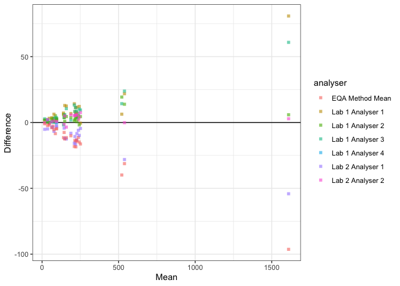
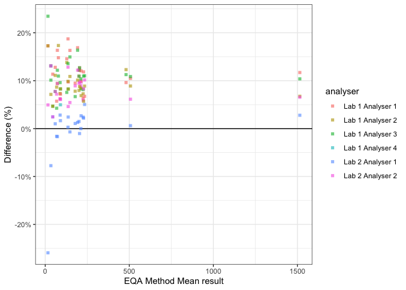

<!-- README.md is generated from README.Rmd. Please edit that file -->

# tidydifference

<!-- badges: start -->
<!-- badges: end -->

## Overview

Tidydifference is a small utility to draw difference plots (aka
Bland-Altman plots). It aims to have a tidy interface

## Installation

You can install the development version of tidydifference like so:

``` r
# install.packages("devtools")
devtools::install_github("divinenephron/tidydifference")
```

## Usage

Plot the absolute difference (default) against the mean result
(default).

``` r
library(tidydifference)
difference_plot(hidx_eqa, sample_col = sample, result_col = h_index, analyser_col = analyser)
```



Plot the relative difference against the EQA method mean (which we’ve
recorded as if it were an analyser).

``` r
difference_plot(hidx_eqa, sample_col = sample, result_col = h_index, analyser_col = analyser, comparison = "EQA Method Mean", difference = "relative")
```


